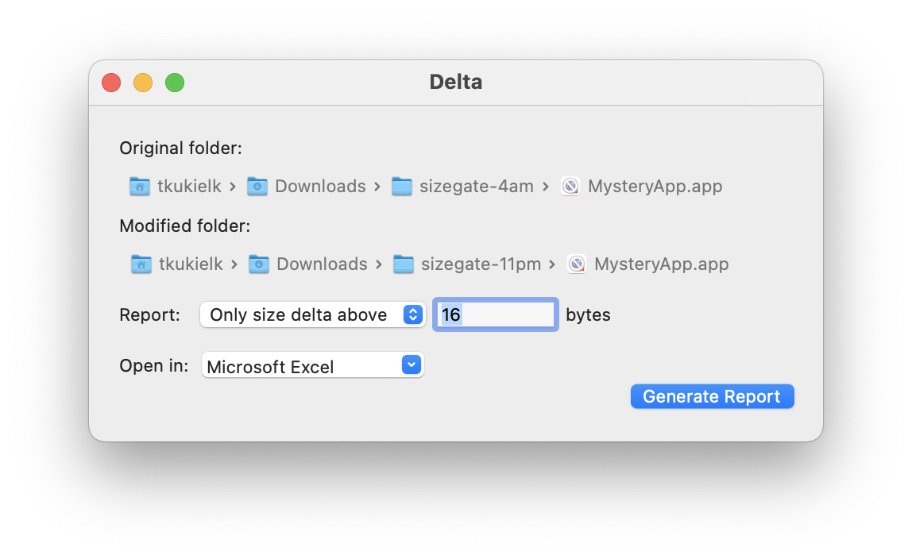

# Delta.app
Delta.app - macOS applet for generating directory differences report in TSV format (tab separated values)

You can use Delta.app to quickly assess which files changed between two directories (or the same directory at two different points in time) and what is the size difference. It is useful when directories contain binary files, for which comparing content differences is meaningless or difficult.
The original purpose of the script (and then applet) was to compare the content of application bundles from two different builds to see if there are any files added, missing, or if the executable binaries are bigger. When you are doing some refactoring or changing the build setup and you are not sure what impact it may have, you may compare the content of the two builds to catch potential regressions or spot undesired direction. When using Delta.app for this purpose, it is worth noting that when comparing app bundles for Mac/iOS you will see that .xib files compiled to .nib files are different with each compilation. In that sense Interface Builder is not stable: it produces different artifacts from the same input. In order to reduce the nib noise, you can use the delta threshold above which the report should produce a line in the TSV file.

The applet has been built with OMC engine:
https://github.com/abra-code/OMC

It uses "replay" tool for up to 5x speed increase by parallelizing script execution:
https://github.com/abra-code/replay
